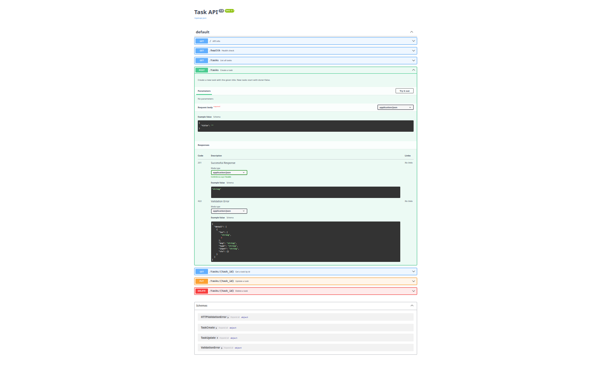

# Task API

A small FastAPI CRUD API for managing a to-do list, backed by a SQLite database (`tasks.db`). Data persists across server restarts. Built for FlyRank Week 2 BE-01, migrated to SQLite for Week 3.

## Objective

Week 2 built this CRUD API with an in-memory Python list as storage — data was lost every time the server restarted. Week 3's assignment is to swap that in-memory list for a real, file-backed SQLite database, **without changing any observable API behavior**: the same 5 endpoints, the same status codes (200/201/204/400/404), and the same error JSON shape/wording as Week 2. The only user-visible difference should be that data now survives a restart.

## Why SQLite

The assignment specifically calls for Python's stdlib `sqlite3` module: no server process to install or run, no extra dependency in `requirements.txt`, and a single portable file (`tasks.db`) that's trivial to inspect (`sqlite3 tasks.db "SELECT * FROM tasks;"`) or delete to reset. For a small single-process CRUD API like this one, that's a better fit than standing up Postgres/MySQL — this app doesn't need concurrent writers across multiple machines, just durable storage across restarts.

## Install & run

Requires Python 3.12.3 (Ubuntu).

```bash
python3 -m venv .venv
source .venv/bin/activate
pip install -r requirements.txt
uvicorn app.main:app --reload
```

On startup, the app creates `tasks.db` in the project root (if it doesn't exist yet) and seeds it with 3 tasks. See [`decisions.md`](decisions.md) for schema and migration notes.

The server starts at [http://localhost:8000](http://localhost:8000).  
Interactive docs (Swagger UI): [http://localhost:8000/docs](http://localhost:8000/docs)

## Endpoints

| Method | Path | Description |
|--------|------|-------------|
| GET | `/` | API name, version, and endpoint list |
| GET | `/health` | Health check (`{"status":"ok"}`) |
| GET | `/tasks` | List all tasks |
| GET | `/tasks/{id}` | Get a task by id |
| POST | `/tasks` | Create a task (`{"title":"..."}`) |
| PUT | `/tasks/{id}` | Partial update (`title` and/or `done`) |
| DELETE | `/tasks/{id}` | Delete a task (204 empty body) |

## Example `curl` output

```bash
curl -i -X POST http://localhost:8000/tasks \
  -H "Content-Type: application/json" \
  -d '{"title":"Buy milk"}'
```

```
HTTP/1.1 201 Created
date: Sun, 26 Jul 2026 18:49:52 GMT
server: uvicorn
content-length: 40
content-type: application/json

{"id":4,"title":"Buy milk","done":false}
```

## Swagger UI



## Verify persistence

This is the main behavior change from Week 2 — data now survives a restart instead of resetting.

```bash
# 1. Create a task and note its id
curl -s -X POST http://localhost:8000/tasks \
  -H "Content-Type: application/json" \
  -d '{"title":"Verify persistence"}'

# 2. Stop the server (Ctrl+C), then confirm the db file exists on disk
ls -la tasks.db

# 3. Restart the server
uvicorn app.main:app --reload

# 4. Confirm the task from step 1 is still there
curl -s http://localhost:8000/tasks
```

To confirm the seed data resets cleanly on a fresh install, delete `tasks.db` and restart the server — it recreates the schema and reseeds the 3 default tasks (`Learn FastAPI`, `Build CRUD API`, `Commit Stage 2`) automatically, since seeding only runs when the table is empty.

## Decisions

Design decisions and tradeoffs for the SQLite migration (schema choices, id-generation semantics, parameterized query patterns, and confirmation that no Week 2 API behavior changed) are documented in [`decisions.md`](decisions.md).
